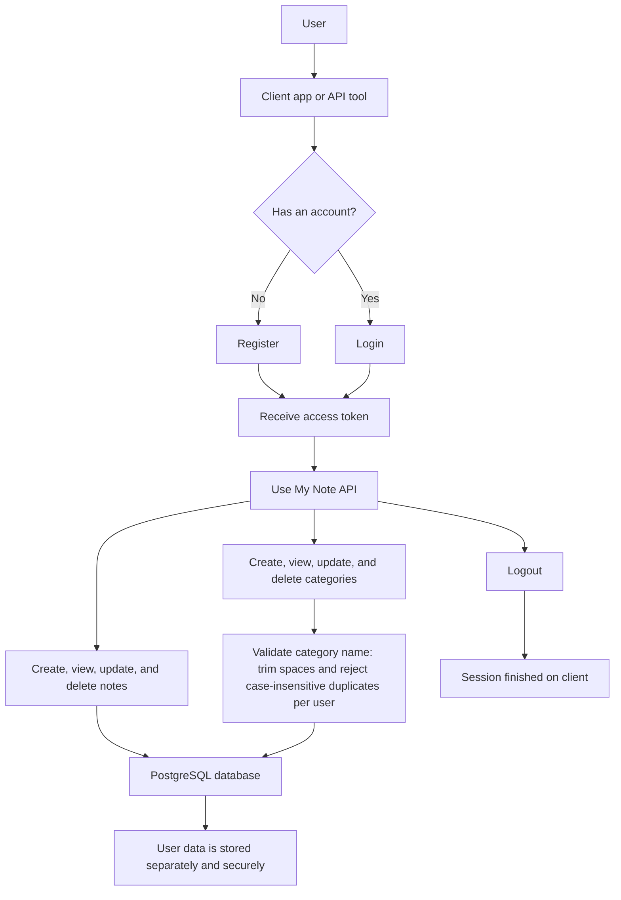

# My Note API 

[](https://github.com/yoesuv/My-Note-SB/actions)
[](https://app.codacy.com/gh/yoesuv/My-Note-SB)
[](https://app.codacy.com/gh/yoesuv/My-Note-SB)

A **Spring Boot** RESTful API for a personal note-taking application with JWT authentication, built with Kotlin, Spring Data JPA, PostgreSQL, Flyway, Spring Security, and JJWT.

## Features

- **Authentication & Authorization**
  - JWT-based authentication with secure token generation
  - User registration and login
  - Token-based API access control

- **Notes Management**
  - Create, read, update, and delete personal notes
  - Pin important notes
  - Filter notes by category
  - Full audit trail (createdAt, updatedAt)

- **Categories**
  - Organize notes with custom categories
  - Color-coded categories for visual organization
  - CRUD operations for category management
  - Category names are trimmed and unique per user, case-insensitively (`Work` and `work` are considered duplicates)

- **Security**
  - Spring Security with JWT tokens
  - Password encryption with BCrypt
  - User-scoped data isolation (users can only access their own data)

## Project Structure

```
my-note/
├── src/main/kotlin/com/yoesuv/mynote/
│   ├── config/          # Configuration classes (Security, JPA, JWT)
│   ├── controller/      # REST API controllers
│   ├── domain/          # JPA entities
│   ├── dto/             # Data Transfer Objects
│   │   ├── auth/        # Auth request/response DTOs
│   │   ├── category/    # Category request/response DTOs
│   │   └── note/        # Note request/response DTOs
│   ├── exception/       # Exception handling
│   ├── repository/      # Spring Data repositories
│   ├── security/        # JWT service and filters
│   └── service/         # Business logic layer
├── src/main/resources/
│   └── db/migration/    # Flyway database migrations
└── docs/                # API documentation
```

## System Flow



## Getting Started

### Prerequisites

- Java 17 or higher
- PostgreSQL 12+
- Gradle is optional because this project includes the Gradle wrapper (`./gradlew`)

### Setup

1. **Clone the repository**
   ```bash
   git clone <repository-url>
   cd my-note
   ```

2. **Create database**
    
   Create a PostgreSQL database. Flyway will create the schema and tables when the application starts.
   ```sql
   CREATE DATABASE mynotes;
   ```
    
   Or using psql:
   ```bash
   psql -U your_username -c "CREATE DATABASE mynotes;"
   ```

3. **Configure database connection**
    
   Create a local configuration file named `local.properties` in the project root. This file is ignored by Git and is automatically imported by the application.
   ```properties
   DB_URL=jdbc:postgresql://localhost:5432/mynotes
   DB_USERNAME=your_username
   DB_PASSWORD=your_password
   ```

   If your PostgreSQL user does not use a password, leave it empty:
   ```properties
   DB_PASSWORD=
   ```

4. **Configure JWT** (optional)
    
   Add JWT settings to `local.properties` if you want to override the defaults:
   ```properties
   JWT_SECRET=your-256-bit-secret-key-here-minimum-32-characters
   ```

5. **Run the application**
   ```bash
   ./gradlew bootRun
   ```

   To run with development seed data, use the `dev` profile:
   ```bash
   ./gradlew bootRun --args='--spring.profiles.active=dev'
   ```

   The `dev` profile seeds demo users, categories, and notes if they do not already exist:

   | Email | Password |
   |-------|----------|
   | `demo@mynotes.com` | `password` |
   | `john@example.com` | `password` |
     
   Or build and run the JAR:
   ```bash
   ./gradlew build
   java -jar build/libs/my-note-0.0.1-SNAPSHOT.jar
   ```

The API will be available at `http://localhost:8080`

## API Documentation

**Base URL:** `http://localhost:8080/api`

| Resource | Endpoints |
|----------|-----------|
| Auth | `POST /auth/register`, `POST /auth/login`, `POST /auth/logout` |
| Notes | `GET/POST /notes`, `GET/PUT/DELETE /notes/{id}` |
| Categories | `GET/POST /categories`, `GET/PUT/DELETE /categories/{id}` |

> All endpoints except `/auth/**` require `Authorization: Bearer <token>` header.

For full documentation with request/response examples and error codes, see:
- [Register API](docs/register.md)
- [Login API](docs/login.md)
- [Notes API](docs/note.md)
- [Categories API](docs/category.md)

## Database Schema

The application uses Flyway for database migrations. Tables are automatically created:

- `users` - User accounts
- `categories` - Note categories
- `notes` - User notes

## Running Tests

```bash
./gradlew test
```

## Building for Production

```bash
./gradlew bootJar
```

The production JAR will be in `build/libs/`.

## License

This project is open source and available under the [MIT License](LICENSE).

---

**Note:** This is a backend API. For a complete application, pair it with a frontend client (web, mobile, or desktop).
